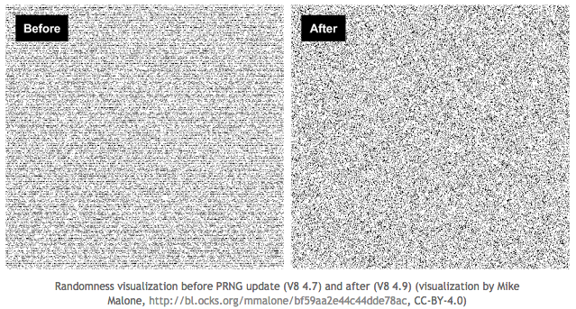
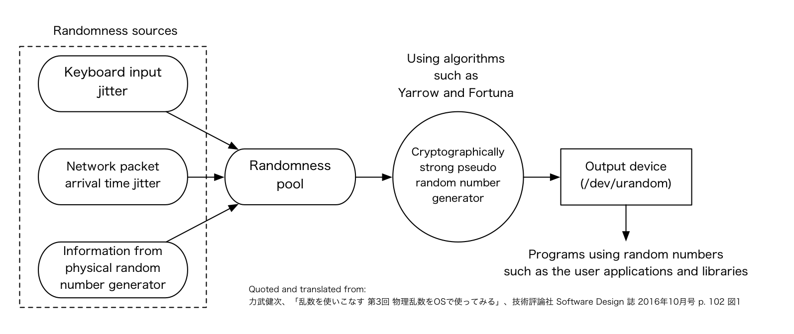
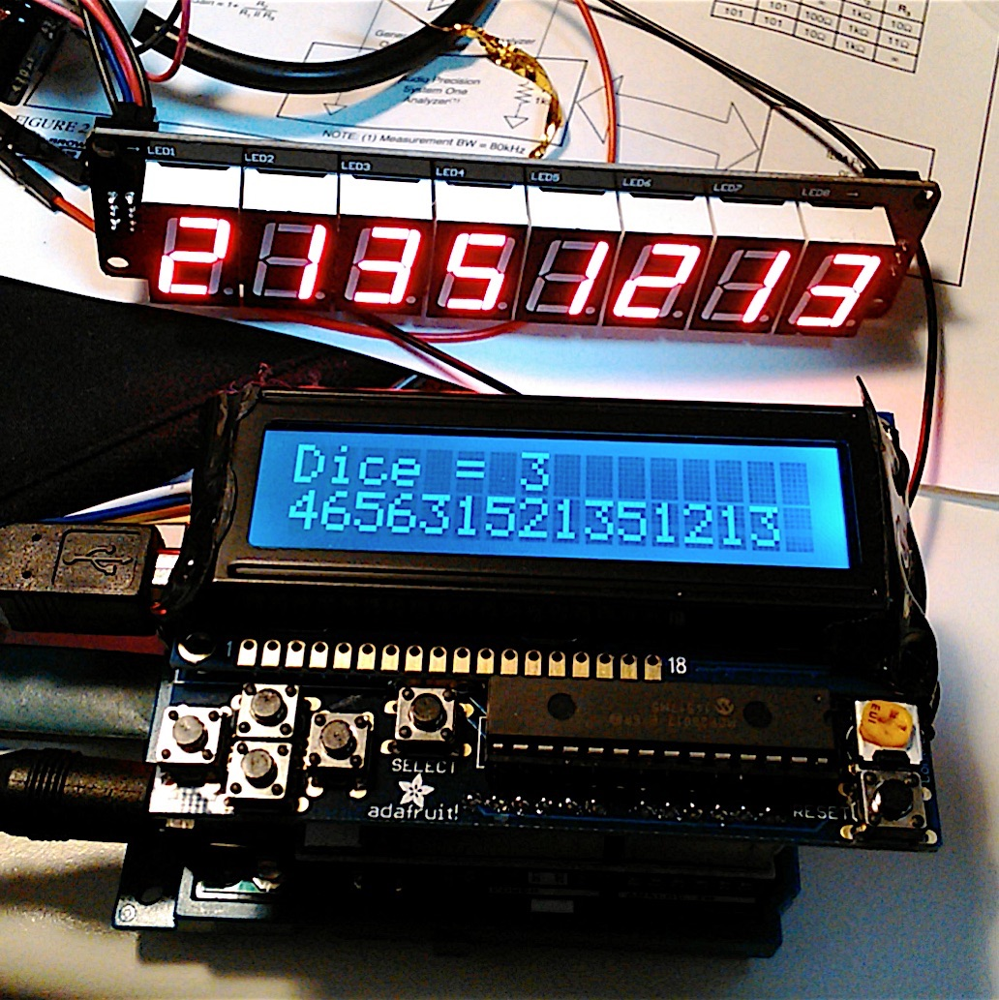
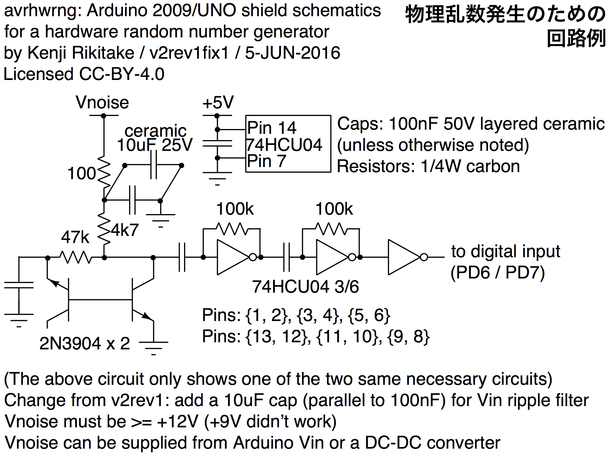
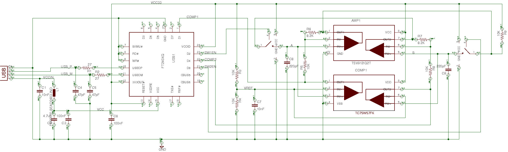
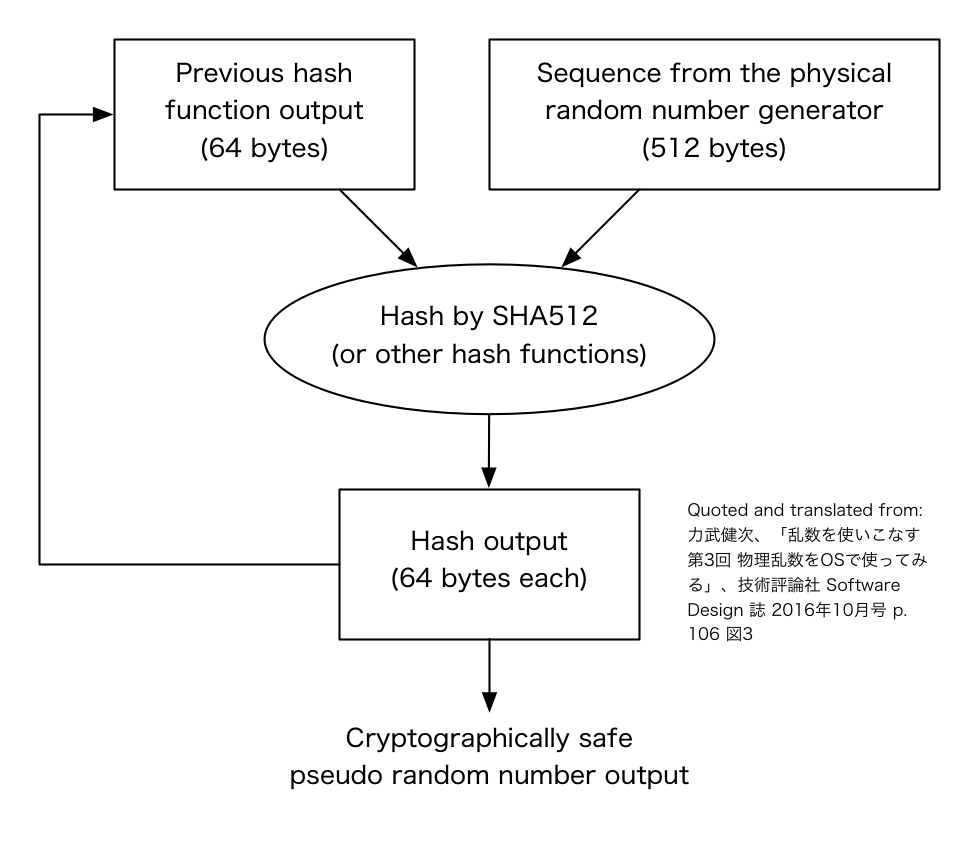
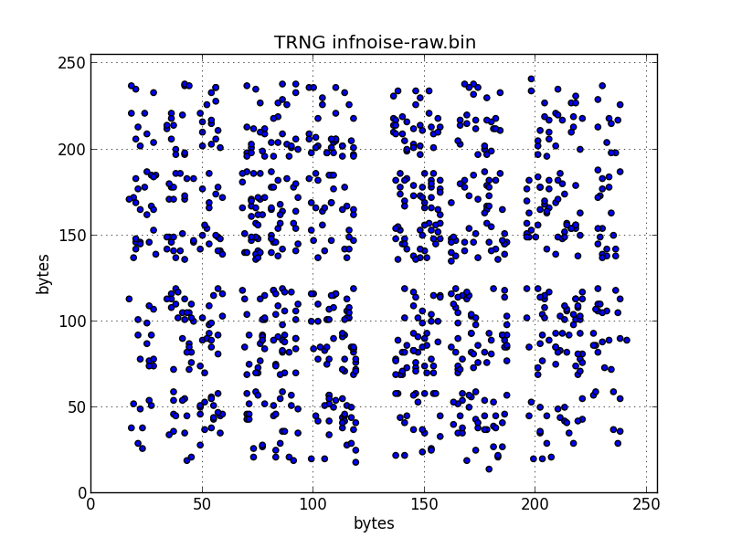
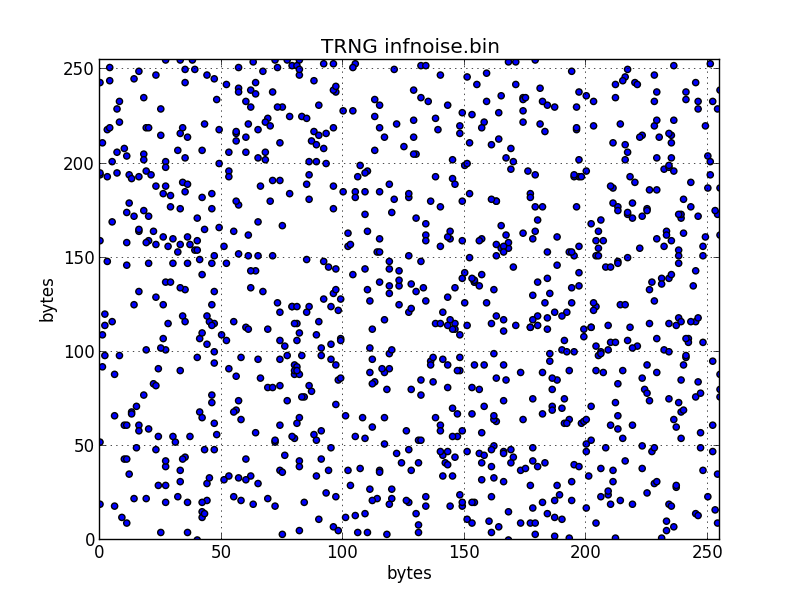

theme: Simple, 2
footer: Kenji Rikitake / Builderscon Tokyo 2018 7-SEP-2018
slidenumbers: true
autoscale: true

<!-- Use Deckset 2.0, 4:3 aspect ratio -->

# [fit] Safe randomness: theory and practice
# [fit] 安全なランダムネスの理論と実践

---

# [fit] Kenji Rikitake
# [fit] りきたけ けんじ

7-SEP-2018
Builderscon Tokyo 2018
Kyoseikan, Keio University
Yokohama City, Kanagawa, Japan
@jj1bdx

Copyright ©2018 Kenji Rikitake.
This work is licensed under a [Creative Commons Attribution 4.0 International License](https://creativecommons.org/licenses/by/4.0/).

---

# [fit] In this talk I'm going to talk about
# [fit] Randomness
# [fit] この発表ではランダムネスについて話します

---

# [fit] What is randomness?
# [fit] ... unpredictability
# [fit] ランダムネスとは予測不能性のことです

---

# [fit] Randomness is essential for
# [fit] secure operation
# [fit] ランダムネスは安全な運用に不可欠です

---

# When randomness needed
# ランダムネスが必要な時

- Password/key generation / パスワードや鍵の生成
- Timing obfuscation / 処理時間を隠す
- Using multiple resources equally but unpredictably / 複数の資源を同じように、しかし予測されないように使いたい

---

# [fit] In algorithm, randomness is represented as:
# [fit] Random numbers
# [fit] アルゴリズムでのランダムネスは
# [fit] **乱数** によって表現します

---

# [fit] My works on random numbers
# [fit] 乱数について何をやってきたか

---

# Software contribution to Erlang/OTP

- Improve the random number algorithms
- 乱数アルゴリズムの改善

- [Erlang/OTP rand module](http://erlang.org/doc/man/rand.html)
- [SFMT for Erlang/OTP](https://github.com/jj1bdx/sfmt-erlang/)
- [TinyMT calculation of 256M keys](https://github.com/jj1bdx/tinymtdc-longbatch)

---

# Bad algorithm example (JS V8)

---

# Legacy Erlang/OTP random module

- A 1980s algorithm called AS183
- [Can be fully scanned in 8 hours](https://github.com/jj1bdx/as183-c)
- Became a security issue - deprecated since OTP 19 (June 2016)
- 8時間で全数検索できてしまう
- セキュリティ問題になりOTPバージョン19（2016年6月）より非推奨

---

# [fit] ... And hardware contribution
# [fit] because software is not enough
# [fit] ソフトだけでは不十分なのでハードもやってます

---

# Why hardware?

- Computers are *programmed* and *predictive* machines; finding randomness inside computers is *extremely difficult*
- コンピュータはプログラムされた通りに、予想通りに動く→コンピュータの中でランダムネスを見つけるのは非常に難しい

---

# Randomness sources in a computer

- CPU clock jitter / CPUクロックの揺れ
- Keyboard timing / キーボード打鍵のタイミング
- Network packet timing / パケットのタイミング
- Storage seeking timing / ストレージのタイミング
- ... Those sources are highly predictive
- … これらのソースは予測可能

---

# Randomness processing flow

` `

---

# [fit] Little randomness available in a system
# [fit] システムの中からはランダムネスは少ししか得られない
## [fit] A result: only ~0.62bit/sec

- A dormant Linux server without attached keyboard
- `/proc/sys/kernel/random/entropy_avail`
- Bits of entropy (= randomness) in the system
- 258 bits / 415.6 seconds (~7 minutes)

---

# [fit] Additional randomness needed
# [fit] 追加のランダムネスが必要

---

# Why? Because:
# [fit] Security depends on unpredictability
# [fit] Secure operations consume randomness
# [fit] Availability of randomness is limited
# [fit] セキュリティは予測不能性に依存している
# [fit] 安全な処理はランダムネスを消費する
# [fit] 使えるランダムネスは有限

---

# Physical randomness source
# 物理的なランダムネス源

- Thermal noise / 熱雑音
- Avalanche noise of semiconductor junctions / 半導体接合部のなだれ降伏雑音
- Timing jitter of oscillation circuits / 発振回路のタイミングの揺れ

---

# Physical random number generator with Arduino UNO

Displayed at Maker Faire Tokyo 2016

This implementation is working as a dice: generating numbers of 1~6 / サイコロ同様に1から6までの数字を生成する

Generating ~10kbytes/sec

---

---

#[fit] Infinity Noise TRNG [^1][^2]

- Thermal noise based
- USD35/device
- Public domain, no patent
- No MCU on the device / デバイスはMCUを持たない
- ~40Kbytes/sec

[^1]: <https://github.com/13-37-org/infnoise>

[^2]: [Crowd Supply product page of Infinity Noise TRNG](https://www.crowdsupply.com/13-37/infinite-noise-trng)

---

# Infinity Noise TRNG schematics

FTDI bitbang I/O controls the noise amplifier

---

# How to inject external randomness to the operating systems

- Linux: random(4) ioctl() of RNDGETENTCNT, RNDADDENTROPY (User accessible)
- FreeBSD: random_harvest(9) (Accessible from kernel modules only) [^3]
- Other proprietary OSes: unable to find the same functions / その他の独自OSでは外部からランダムネスを注入できない

[^3]: [My FreeBSD randomness injection device driver](https://github.com/jj1bdx/freebsd-dev-trng)

---

# Whitening for uniform distribution

- Cryptographically strong hash functions are used in the whitening
- Whitening is implemented in the driver or the post-processing software
- 暗号化ハッシュ関数を適用して出力の分布を一様化する処理（ホワイトニング）が必要

---

# [fit] How whitening works on Infinity Noise TRNG

` `

---

# How much randomness is enough?

- USD <100 generator: ~100kbytes/sec or more, more than sufficient for an active server
- If you generate *a lot of* keys/passwords, consider dedicated generator of Mbps or Gbps class (they exist but expensive)
- ハードウェア生成器があれば~100kバイト/秒（通常の運用には十分）
- 本気で大量に鍵やパスワードを生成するなら専用の物理乱数生成器を導入すべし

---

# Summary/まとめ

- Good randomness is hard to obtain
- External physical random number generator is essential for secure operation
- Do not invent your own methods
- 良いランダムネスを得るのは難しい
- 安全な運用には外部の物理乱数装置が不可欠
- 自己流でやらない

---

# Other references

- <https://github.com/jj1bdx/avrhwrng/>
- [Fifteen Ways to Leave Your Random Module](https://speakerdeck.com/jj1bdx/fifteen-ways-to-leave-your-random-module) (Erlang User Conference 2016)
- [疑似乱数の作り方・使い方 ゲームから情報セキュリティまで](https://speakerdeck.com/jj1bdx/jeita-20171026)

---

# [fit] Thanks
# [fit] Questions?
# [fit] Give the feedback please; use the QR code on your name card
# [fit] フィードバックをおねがいします / ネームカードのQRコードを使ってください

<!--
Local Variables:
mode: markdown
coding: utf-8
End:
-->
